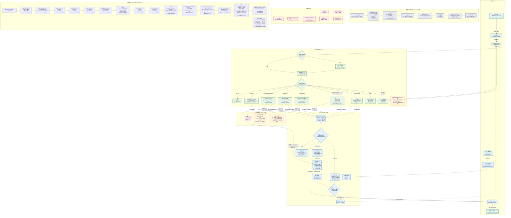

```mermaid
graph TD
    subgraph "整体流程"
        direction LR
        Input["源代码文件<br/>(例如: int main() { return 10; })"] 
        Input -- "stdin/文件输入" --> InputBuffer["输入缓冲区<br/>(yytext指向当前位置)"]
        InputBuffer -- "逐字符扫描" --> L1
        P_Finish("yyparse() 完成<br/>返回0(成功)或1(失败)") 
        P_Finish -- "通过 *ast 参数传出" --> Output["最终AST字符串:<br/>'int main() { return 10; }'"]
        
        MainCall["main() 函数调用<br/>char *ast = NULL;<br/>yyparse(&ast);"] -- "启动解析" --> P1
    end

    subgraph "Parser (由 sysy.y 生成)"
        P1("yyparse() 启动<br/>初始化解析栈<br/>当前状态: 等待CompUnit") --> P_InitStack["解析栈初始化<br/>状态栈: [0]<br/>符号栈: []"]
        P_InitStack --> P_NeedToken{"需要下一个Token?<br/>查看当前语法规则<br/>和栈顶状态"}
        P_NeedToken -- "是: 进行移进(Shift)" --> P_CallLex("调用 yylex()<br/>请求下一个Token")
        
        P_Receive[("接收Token和语义值<br/>Token类型存入解析器<br/>yylval值已设置")] --> P_CheckAction{"检查ACTION表<br/>当前状态+Token<br/>→ 移进/归约/接受/错误?"}
        
        P_CheckAction -- "移进(Shift)" --> P_Shift("执行移进操作<br/>1. Token压入符号栈<br/>2. 新状态压入状态栈<br/>3. 语义值压入值栈")
        P_Shift --> P_NeedToken
        
        P_CheckAction -- "归约(Reduce)" --> P_Reduce("执行归约操作<br/>1. 弹出右部符号<br/>2. 查GOTO表得新状态<br/>3. 执行语义动作")
        P_Reduce -- "执行C代码块" --> P_BuildAST("语义动作执行:<br/>- 计算字符串长度<br/>- malloc分配内存<br/>- sprintf格式化拼接<br/>- free释放子节点<br/>- 设置$$返回值")
        P_BuildAST -- "将结果压入值栈" --> P_UpdateStack["更新解析栈<br/>压入左部非终结符<br/>压入GOTO新状态"]
        P_UpdateStack --> P_NeedToken
        
        P_CheckAction -- "接受(Accept)" --> P_Finish
        P_CheckAction -- "错误" --> P_Error("语法错误!<br/>调用 yyerror(char **ast, const char *s)<br/>输出错误信息到stderr")
        
        P_NeedToken -- "否: 已达到接受状态" --> P_Finish
    end

    subgraph "Lexer (由 sysy.l 生成)"
        L1("yylex() 开始扫描<br/>从当前输入位置读取") --> L_BufferCheck{"检查输入缓冲区<br/>是否需要填充?"}
        L_BufferCheck -- "需要" --> L_FillBuffer["从输入源读取<br/>填充yytext缓冲区"]
        L_FillBuffer --> L_StartMatch
        L_BufferCheck -- "充足" --> L_StartMatch["开始模式匹配<br/>从当前位置扫描"]
        
        L_StartMatch --> L_FindMatch{"DFA状态机匹配<br/>找到最长匹配的规则?"}
        
        L_FindMatch -- "空白符[ \\t\\n\\r]+" --> L_WhiteSpace["匹配WhiteSpace<br/>执行空动作{}<br/>继续扫描"]
        L_WhiteSpace --> L1
        
        L_FindMatch -- "注释//.*" --> L_Comment["匹配LineComment<br/>执行空动作{}<br/>跳过至行尾"]
        L_Comment --> L1
        
        L_FindMatch -- "关键字'int'|'return'" --> L_Keyword["匹配关键字<br/>return INT/RETURN;<br/>无需设置yylval"]
        
        L_FindMatch -- "标识符[a-zA-Z_][a-zA-Z0-9_]*" --> L_Ident["匹配Identifier<br/>1. yylval.str_val = strdup(yytext)<br/>2. return IDENT<br/>注意: 关键字优先匹配"]
        
        L_FindMatch -- "十进制[1-9][0-9]*" --> L_Decimal["匹配Decimal(非0开头)<br/>yylval.int_val = strtol(yytext, NULL, 0)<br/>return INT_CONST"]
        L_FindMatch -- "八进制0[0-7]*" --> L_Octal["匹配Octal(0开头)<br/>yylval.int_val = strtol(yytext, NULL, 0)<br/>return INT_CONST"]
        L_FindMatch -- "十六进制0[xX][0-9a-fA-F]+" --> L_Hex["匹配Hexadecimal<br/>yylval.int_val = strtol(yytext, NULL, 0)<br/>return INT_CONST"]
        
        L_FindMatch -- "单字符(){};" --> L_Single["匹配任意单字符(.规则)<br/>return yytext[0]<br/>返回字符ASCII码作为Token"]
        
        L_FindMatch -- "无匹配" --> L_Error["词法错误<br/>无法识别的字符"]
        
        L_Note["重要: Flex按规则定义顺序匹配<br/>优先级: 关键字 > 标识符 > 数字 > 单字符<br/>. 最后兜底匹配所有未处理字符"]
        
        L_Keyword -- "返回Token类型" --> P_Receive
        L_Ident -- "返回Token类型+字符串值" --> P_Receive
        L_Decimal -- "返回Token类型+整数值" --> P_Receive
        L_Octal -- "返回Token类型+整数值" --> P_Receive
        L_Hex -- "返回Token类型+整数值" --> P_Receive
        L_Single -- "返回字符ASCII" --> P_Receive
    end
    
    subgraph "数据交换核心: yylval 联合体"
        style YYLVAL fill:#fdf,stroke:#333,stroke-width:2px
        
        YYLVAL_Detail["yylval联合体详情:<br/>定义在sysy.y中<br/>union {<br/>  char *str_val; // 标识符字符串<br/>  int int_val;   // 整数常量值<br/>}"]
        
        L_Ident -- "写入.str_val<br/>动态分配内存" --> YYLVAL("yylval<br/>全局变量")
        L_Decimal -- "写入.int_val<br/>转换后的整数" --> YYLVAL
        L_Octal -- "写入.int_val<br/>转换后的整数" --> YYLVAL
        L_Hex -- "写入.int_val<br/>转换后的整数" --> YYLVAL
        
        YYLVAL -- "读取.str_val或.int_val<br/>在归约动作中作为$1,$2,$3..." --> P_BuildAST
        
        MemoryNote["内存管理注意:<br/>- str_val需要在使用后free<br/>- int_val是值类型无需释放<br/>- $$赋值会成为父节点的语义值"]
    end
    
    subgraph "语法规则解析详情 (以 FuncDef 为例)"
        R_FuncDef["FuncDef规则触发<br/>FuncType IDENT '(' ')' Block"]
        R_FuncDef --> R_GetSymbols["从值栈获取5个符号:<br/>$1=FuncType字符串<br/>$2=IDENT字符串<br/>$3='('字符<br/>$4=')'字符<br/>$5=Block字符串"]
        
        R_GetSymbols --> R_CalcLen["计算总长度:<br/>len = strlen($1) + 1 + strlen($2)<br/>    + 2 + 1 + strlen($5) + 1<br/>(空格+括号+结尾\\0)"]
        
        R_CalcLen --> R_Malloc["分配内存:<br/>char *result = malloc(len)"]
        
        R_Malloc --> R_Sprintf["格式化字符串:<br/>sprintf(result, &quot;%s %s() %s&quot;,<br/>        $1, $2, $5)"]
        
        R_Sprintf --> R_Assign["设置返回值:<br/>$$ = result"]
        
        R_Assign --> R_Free["释放子节点内存:<br/>free($1); free($2); free($5)<br/>(防止内存泄漏)"]
        
        R_Free --> R_Return["归约完成<br/>返回到解析器主循环"]
    end
    
    subgraph "错误处理机制"
        E_LexError["词法错误<br/>无法识别字符"] --> E_LexReport["输出词法错误信息<br/>可能终止或继续"]
        
        E_SyntaxError["语法错误<br/>Token不匹配规则"] --> E_CallError["调用yyerror(ast, msg)"]
        E_CallError --> E_PrintError["fprintf(stderr, &quot;error: %s\\n&quot;, s)<br/>输出到标准错误流"]
        E_PrintError --> E_Cleanup["清理解析栈<br/>释放已分配内存"]
        E_Cleanup --> E_Return["返回错误代码<br/>yyparse()返回1"]
    end

    P_CallLex -.-> L1

    classDef parser fill:#e3f2fd,stroke:#1565c0,stroke-width:2px;
    classDef lexer fill:#e8f5e9,stroke:#2e7d32,stroke-width:2px;
    classDef note fill:#fff3e0,stroke:#f57c00,stroke-width:1px;
    classDef memory fill:#f3e5f5,stroke:#7b1fa2,stroke-width:2px;
    classDef rule fill:#e8eaf6,stroke:#3f51b5,stroke-width:2px;
    classDef error fill:#ffebee,stroke:#d32f2f,stroke-width:2px;
    classDef main fill:#e0f2f1,stroke:#00695c,stroke-width:2px;
    classDef example fill:#f1f8e9,stroke:#558b2f,stroke-width:2px;
    
    class P1,P_InitStack,P_NeedToken,P_CallLex,P_Receive,P_CheckAction,P_Shift,P_Reduce,P_BuildAST,P_UpdateStack,P_Error,P_Finish parser;
    class L1,L_BufferCheck,L_FillBuffer,L_StartMatch,L_FindMatch,L_WhiteSpace,L_Comment,L_Keyword,L_Ident,L_Decimal,L_Octal,L_Hex,L_Single,L_Error lexer;
    class L_Note,YYLVAL_Detail,MemoryNote note;
    class YYLVAL,Ex_Memory memory;
    class R_FuncDef,R_GetSymbols,R_CalcLen,R_Malloc,R_Sprintf,R_Assign,R_Free,R_Return rule;
    class E_LexError,E_SyntaxError,E_CallError,E_PrintError,E_Cleanup,E_Return,E_LexReport error;
    class MainCall,Input,InputBuffer,Output main;
    class Ex_Start,Ex_Step1,Ex_Step2,Ex_Step3,Ex_Step4,Ex_Step5,Ex_Step6,Ex_Step7,Ex_Step8,Ex_Step9,Ex_Reduce1,Ex_Reduce2,Ex_Reduce3,Ex_Reduce4,Ex_Reduce5,Ex_Final example;
    
    subgraph "具体解析示例: 'int main() { return 10; }'"
        Ex_Start["输入字符串: int main() { return 10; }"] --> Ex_Step1["Step1: yylex()→INT<br/>匹配'int'关键字<br/>无yylval值<br/>ACTION: Shift状态1"]
        Ex_Step1 --> Ex_Step2["Step2: yylex()→IDENT<br/>匹配'main'标识符<br/>yylval.str_val=strdup(&quot;main&quot;)<br/>ACTION: Shift状态2"]
        Ex_Step2 --> Ex_Step3["Step3: yylex()→'('<br/>匹配左括号<br/>ASCII=40<br/>ACTION: Shift状态3"]
        Ex_Step3 --> Ex_Step4["Step4: yylex()→')'<br/>匹配右括号<br/>ASCII=41<br/>ACTION: Shift状态4"]
        Ex_Step4 --> Ex_Step5["Step5: yylex()→'{'<br/>匹配左大括号<br/>ASCII=123<br/>ACTION: Shift状态5"]
        Ex_Step5 --> Ex_Step6["Step6: yylex()→RETURN<br/>匹配'return'关键字<br/>无yylval值<br/>ACTION: Shift状态6"]
        Ex_Step6 --> Ex_Step7["Step7: yylex()→INT_CONST<br/>匹配'10'十进制数<br/>yylval.int_val=10<br/>ACTION: Shift状态7"]
        Ex_Step7 --> Ex_Step8["Step8: yylex()→';'<br/>匹配分号<br/>ASCII=59<br/>ACTION: Shift状态8"]
        Ex_Step8 --> Ex_Step9["Step9: yylex()→'}'<br/>匹配右大括号<br/>ASCII=125<br/>ACTION: Shift状态9"]
        
        Ex_Step9 --> Ex_Reduce1["归约1: Number→INT_CONST<br/>弹出$1=10<br/>执行sprintf(buffer, &quot;%d&quot;, 10)<br/>$$=strdup(&quot;10&quot;)<br/>压入Number,新状态"]
        Ex_Reduce1 --> Ex_Reduce2["归约2: Stmt→RETURN Number ';'<br/>弹出3个符号<br/>$$=sprintf(&quot;return %s;&quot;, &quot;10&quot;)<br/>结果=&quot;return 10;&quot;<br/>free(&quot;10&quot;)"]
        Ex_Reduce2 --> Ex_Reduce3["归约3: Block→'{' Stmt '}'<br/>弹出3个符号<br/>$$=sprintf(&quot;{ %s }&quot;, &quot;return 10;&quot;)<br/>结果=&quot;{ return 10; }&quot;<br/>free(&quot;return 10;&quot;)"]
        Ex_Reduce3 --> Ex_Reduce4["归约4: FuncType→INT<br/>弹出$1=INT_token<br/>$$=strdup(&quot;int&quot;)<br/>压入FuncType,新状态"]
        Ex_Reduce4 --> Ex_Reduce5["归约5: FuncDef→FuncType IDENT '(' ')' Block<br/>弹出5个符号<br/>$$=sprintf(&quot;%s %s() %s&quot;, &quot;int&quot;, &quot;main&quot;, &quot;{ return 10; }&quot;)<br/>结果=&quot;int main() { return 10; }&quot;<br/>释放所有子节点内存"]
        Ex_Reduce5 --> Ex_Final["归约6: CompUnit→FuncDef<br/>*ast = &quot;int main() { return 10; }&quot;<br/>yyparse()返回0<br/>解析成功完成!"]
        
                Ex_Memory["内存追踪示例:<br/>1. strdup(&quot;main&quot;) → 堆分配<br/>2. strdup(&quot;10&quot;) → 堆分配<br/>3. &quot;return 10;&quot; → 堆分配<br/>4. &quot;{ return 10; }&quot; → 堆分配<br/>5. 每次归约后free子节点<br/>6. 最终只保留根节点字符串"]
    end
```